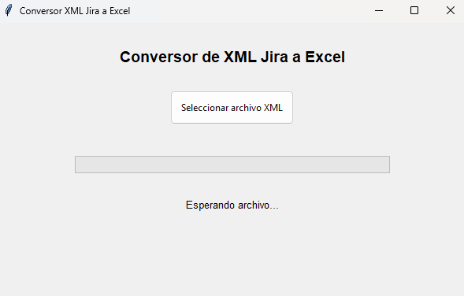

# Conversor de XML de Jira a Excel

[](https://opensource.org/licenses/MIT)
[](https://www.python.org/downloads/)
[](https://pandas.pydata.org/)

Una aplicación GUI en Python que convierte exportaciones XML de Jira a Excel (.xlsx) con soporte para campos personalizados, formato de fechas y preservación de hipervínculos. Incluye seguimiento de progreso, manejo de errores y formato automático de columnas.



## 🚀 Inicio Rápido

```bash
# Clonar el repositorio
git clone https://github.com/yourusername/jira-xml-excel-converter.git

# Navegar al directorio del proyecto
cd jira-xml-excel-converter

# Instalar paquetes requeridos
pip install -r requirements.txt

# Ejecutar la aplicación
python jira-to-excel.py
```

## ✨ Características

- **Interfaz Gráfica Amigable**
  - Ventana simple e intuitiva
  - Barra de progreso para seguimiento de la conversión
  - Mensajes de estado y error
  - Botón de selección de archivo

- **Procesamiento de Datos**
  - Análisis XML con manejo de codificación
  - Extracción de campos estándar y personalizados
  - Conversión de fechas a formato dd/mm/yyyy
  - Separación de columnas de fecha y hora

- **Formato Excel**
  - Hipervínculos activos a tareas de Jira
  - Formato numérico para horas
  - Ajuste automático del ancho de columnas
  - Estilos visuales para mejor legibilidad

## 📋 Campos Procesados

- Código de tarea (con hipervínculo activo)
- Tipo
- Prioridad
- Empresa (campo personalizado)
- Tipo de Tarea (campo personalizado)
- Horas Utilizadas (campo numérico)
- Estado
- Resumen
- Asignado
- Reportado por
- Fechas y horas de creación y actualización

## 🛠 Requisitos

### Dependencias
```bash
pip install pandas openpyxl
```

### Bibliotecas Utilizadas
- `xml.etree.ElementTree`: Procesamiento XML
- `pandas`: Manejo de datos y exportación a Excel
- `tkinter`: Interfaz gráfica
- `openpyxl`: Formato avanzado de Excel
- `datetime`: Manejo de fechas y horas
- `codecs`: Gestión de codificación de archivos
- `threading`: Procesamiento en segundo plano

## 📖 Uso

1. Ejecutar la aplicación:
   ```python
   python jira-to-excel.py
   ```

2. Seguir estos pasos:
   - Hacer clic en "Seleccionar archivo XML"
   - Elegir la exportación XML de Jira
   - Esperar a que se complete el procesamiento
   - Encontrar el archivo Excel en la misma ubicación

3. Salida:
   - Archivo Excel nombrado: `jira_export_[TIMESTAMP].xlsx`
   - Todas las columnas procesadas incluidas
   - Formato optimizado para filtrado y análisis

## 🏗 Estructura del Código

### Clase Principal: `JiraXMLConverter`

#### Métodos de Interfaz
- `__init__`: Inicialización de ventana
- `setup_ui`: Configuración de elementos visuales
- `run`: Inicio de aplicación

#### Métodos de Procesamiento
- `process_file`: Manejo de selección de archivo
- `process_xml`: Procesamiento principal de XML
- `parse_jira_date`: Conversión de fechas
- `clean_xml_content`: Limpieza de XML

#### Métodos de Extracción
- `get_text`: Extracción de texto de elementos XML
- `get_customfield_value`: Procesamiento de campos personalizados
- `get_assignee`: Obtención de asignado
- `get_reporter`: Obtención de reportero

## ⚠️ Notas Importantes

- El XML debe ser una exportación válida de Jira
- Los campos personalizados deben existir en el XML
- Las fechas se procesan considerando la zona horaria
- Las horas se formatean con un decimal
- Los hipervínculos apuntan a las tareas en Jira

## 🐛 Manejo de Errores

- Validación de archivo XML
- Manejo de caracteres especiales
- Conversión segura de datos numéricos
- Mensajes de error descriptivos
- Recuperación de errores por registro

## 🤝 Contribuciones

¡Las contribuciones son bienvenidas! No dudes en enviar un Pull Request. Para cambios mayores, por favor abre primero un issue para discutir lo que te gustaría cambiar.

1. Haz un fork del proyecto
2. Crea tu rama de características (`git checkout -b feature/CaracteristicaIncreible`)
3. Haz commit de tus cambios (`git commit -m 'Agrega alguna CaracteristicaIncreible'`)
4. Haz push a la rama (`git push origin feature/CaracteristicaIncreible`)
5. Abre un Pull Request

## 📄 Licencia

Este proyecto está licenciado bajo la Licencia MIT - ver el archivo [LICENSE](LICENSE) para más detalles.

## 👤 Autor

Bryan Ramírez - [Tu Perfil de GitHub](https://github.com/ezzeker)

## 🙏 Agradecimientos

- A Jira por la funcionalidad de exportación XML
- A la comunidad Python por las increíbles bibliotecas
- A todos los contribuidores que ayudan a mejorar esta herramienta

## 📝 Por Hacer

- [ ] Agregar soporte para múltiples archivos XML
- [ ] Implementar mapeo de campos personalizados
- [ ] Agregar plantillas de exportación
- [ ] Soporte para diferentes formatos de fecha
- [ ] Modo oscuro para la GUI